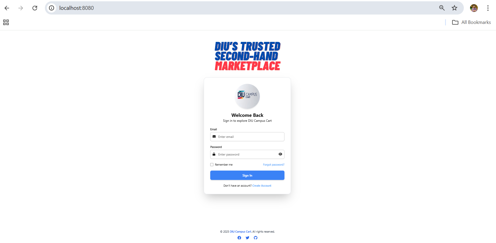
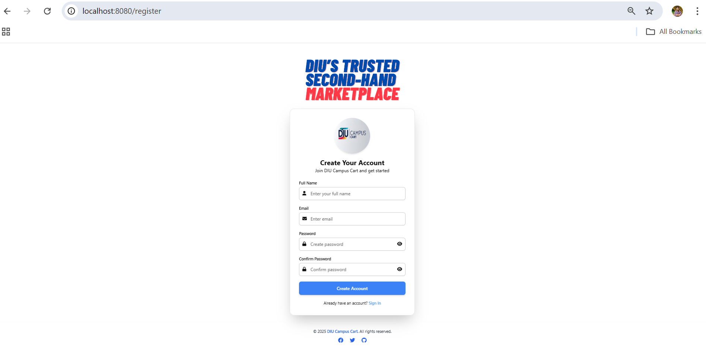
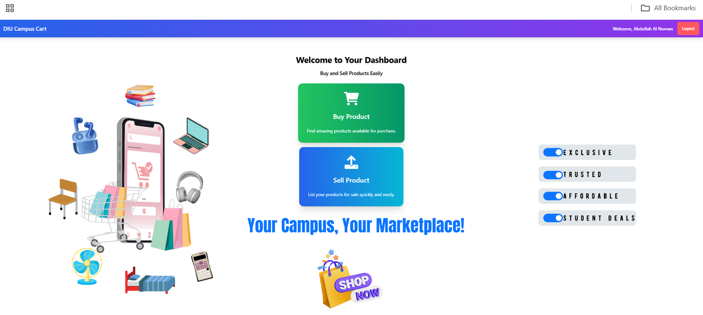
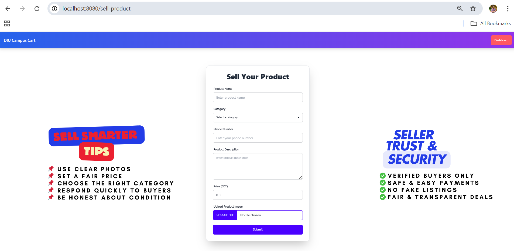
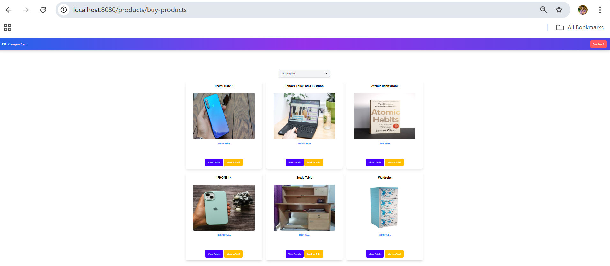
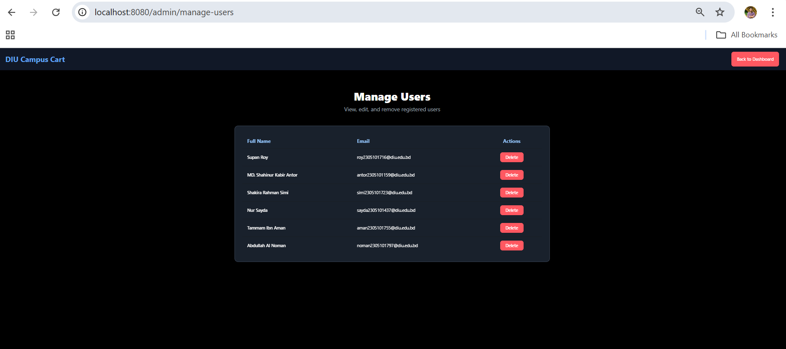
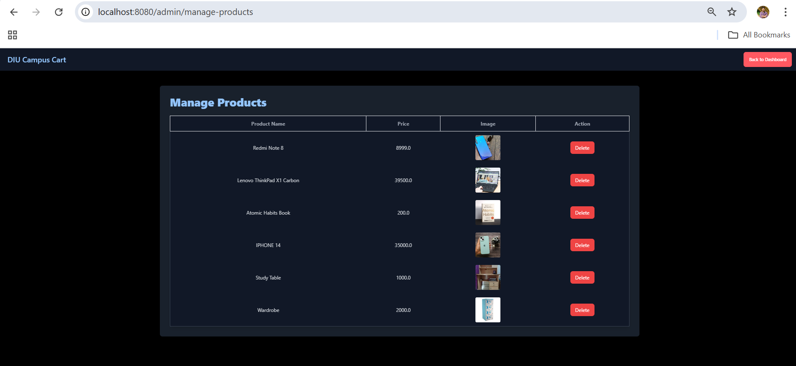

<h1 align="center">🎓 DIU CampusCart</h1> 

## Developer Credits

This project **DIU Campus Cart** was fully developed and maintained by:

**Abdullah Al Noman**  
Student, Daffodil International University  

> Note: This project was a group submission, but all frontend, backend, integration, and feature implementations (including authentication, email verification, buy request system, dashboard, and product handling) were solely developed by Abdullah Al Noman.

Unauthorized use or claim without permission is not allowed. This repository and its code are protected under open-source licensing.

  A smart buy & sell platform exclusively for DIU students, built with ❤️ using Spring Boot, Tailwind CSS, and Thymeleaf.

  
  
  
  

## 📌 Project Overview

**DIU CampusCart** is a second hand marketplace made specifically for the students of **Daffodil International University**. The platform enables DIU students to list items for sale, browse available products, and submit buy requests — all in a secure and student-only ecosystem.

> 🔐 Only verified DIU email users (@diu.edu.bd) can register and use the platform.

## ✨ Key Features

- 🧾 **DIU Email Verification** via JavaMailSender
- 👤 **Session-Based Authentication** for Login/Logout
- 📋 **Product Listing with Category Selection**
- 💬 **Buy Request via Email with Accept/Reject Option**
- ✅ **Seller Accept Link (Email Confirmation)**
- 📦 **Mark Product as “Sold Out”**
- 📊 **Seller Dashboard for Product Management**
- 🎨 **Beautiful UI with Tailwind CSS + DaisyUI**
- 💾 **H2 Persistent Database**

## 🧰 Tech Stack

| Layer       | Technology                      |
|-------------|----------------------------------|
| Backend     | Java, Spring Boot                |
| Frontend    | HTML, Tailwind CSS, DaisyUI      |
| Templating  | Thymeleaf                        |
| Database    | H2 (File-based Persistent Mode)  |
| Email       | JavaMailSender (Gmail SMTP)      |
| Auth        | Session-based Authentication     |

## 📸 Screenshots

### Login

### Registration

### Dashboard

### Sell

### Buy

### Admin Dashboard

### Manage Users

### Manage Product

## 🧠 Upcoming Features

- 📱 Mobile App Integration (Flutter or React Native)
- 📬 In-App Messaging Between Users

## 💬 Feedback & Support

- Found a bug? Open an [Issue](https://github.com/noman797/DIU-CampusCart/issues)
- Want to contribute? Fork the repo & create a pull request.
- Have a suggestion? Let’s connect!

## 🌟 Show Your Support

If you like this project, don’t forget to ⭐ the repository!

  Made with ❤️ by Abdullah Al Noman

